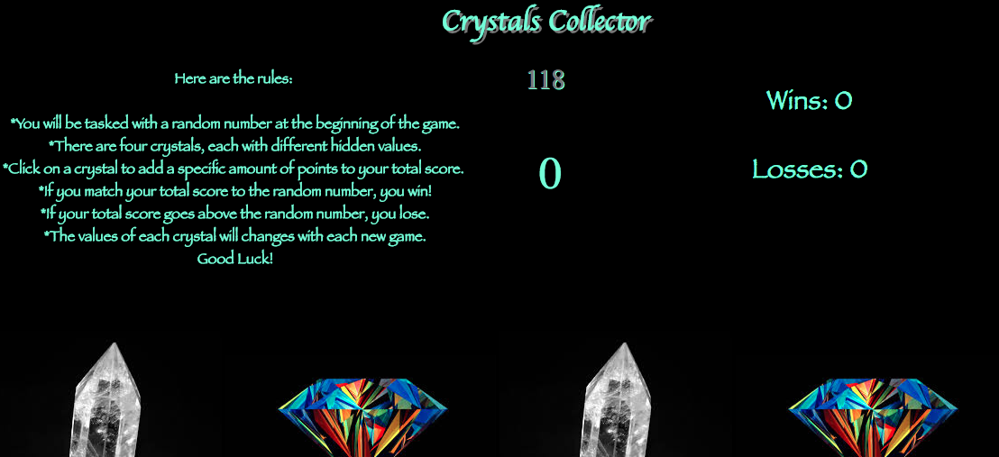

# week-4-game

Users will be tasked with a random number at the beginning of the game.
There are four crystals, each with different hidden values. They may Click on a crystal to add a specific amount of points to the total score. If a user matches their total score to the random number, the game is won. If their total score goes above the random number, they lose.  The values of each crystal will change with each new game.

Technologies/Languages Used:

HTML/CSS/Javascript

<a href="https://katherinerinas.github.io/week-4-game/">GitHub Pages Link</a>

